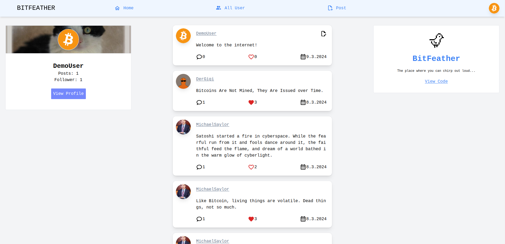

# BitFeather Fullstack Project README

## Description

This is a Fullstack project consisting of a [frontend](https://github.com/DayanWalter/bitfeather/tree/main/frontend)
and a [backend](https://github.com/DayanWalter/bitfeather/tree/main/backend). The frontend is built using React, while the backend is developed with Express and MongoDB.

Live Preview: [BitFeather](https://bitfeather.onrender.com/)

## Note

Ensure you configure the environment variables appropriately

frontend:

- VITE_SERVER_URL

backend:

- ACCESS_TOKEN_SECRET
- DEV_DB_URL

In development:

- tests (front and backend)
